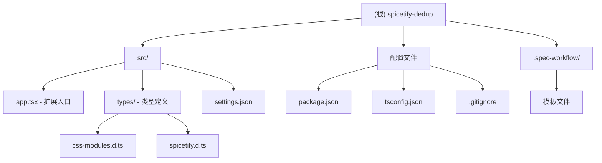

# Spicetify Dedup Extension

> Spotify PC 端查重插件 - 防止重复添加相似音乐到歌单

## 变更记录 (Changelog)

### 2025-12-02 13:36:16
- 初始化 AI 上下文文档
- 创建项目架构索引

---

## 项目愿景

这是一个基于 Spicetify Creator 的 Spotify 桌面扩展，旨在为 PC 端 Spotify 用户提供智能查重功能。当用户尝试将歌曲添加到歌单时，扩展会自动检测该歌曲的类似版本是否已存在于歌单中，如存在则禁止重复添加，避免歌单中出现重复或相似的音乐版本。

### 核心功能
- 实时监听音乐播放事件
- 智能识别歌曲相似版本（原版、混音、现场版等）
- 拦截重复添加操作并提供友好提示
- 支持用户自定义查重规则

---

## 架构总览

### 技术栈
- **框架**: Spicetify Creator
- **语言**: TypeScript
- **UI 库**: React (通过 Spicetify API)
- **构建工具**: esbuild (via spicetify-creator)
- **编译目标**: ES2017, CommonJS

### 项目特性
- 使用 Spicetify Creator 提供的现代化开发工作流
- 支持 TypeScript/JSX 语法和 React 组件
- 支持 CSS/SCSS 模块化样式
- 极速编译（esbuild）
- 热重载开发模式

---

## 模块结构图



---

## 模块索引

| 模块路径 | 职责 | 入口文件 | 状态 |
|---------|------|----------|------|
| `src/` | 扩展源代码 | `app.tsx` | 模板代码 |
| `src/types/` | TypeScript 类型定义 | `css-modules.d.ts`, `spicetify.d.ts` | 完整 |
| `.spec-workflow/` | 开发规范与模板 | - | 可选 |

---

## 运行与开发

### 前置要求
- 已安装 Spicetify CLI
- Node.js 环境（用于构建）
- PC 端 Spotify 客户端

### 安装依赖
```bash
npm install
```

### 开发命令

#### 监听模式（热重载）
```bash
npm run watch
```
自动监听文件变更并重新编译，适合开发时使用。

#### 构建（生产）
```bash
npm run build
```
构建优化后的扩展代码。

#### 构建到本地（压缩）
```bash
npm run build-local
```
构建到 `dist/` 目录并进行代码压缩。

### 部署
构建完成后，扩展会自动部署到 Spicetify 扩展目录。使用以下命令应用更改：
```bash
spicetify apply
```

---

## 测试策略

### 当前状态
- 项目尚未包含自动化测试框架

### 推荐测试方法
1. **手动测试**
   - 在 Spotify 客户端中实际操作验证功能
   - 测试不同场景下的查重逻辑

2. **开发工具**
   - 使用 Chrome DevTools 调试（Spotify 基于 Electron）
   - 通过 `Spicetify.showNotification()` 输出调试信息

3. **未来改进**
   - 考虑引入 Jest 或 Vitest 进行单元测试
   - 使用 Playwright 进行 E2E 测试

---

## 编码规范

### TypeScript 配置
- **目标**: ES2017
- **模块系统**: CommonJS
- **严格模式**: 已启用 (`strict: true`)
- **JSX**: React

### 代码风格建议
1. **命名约定**
   - 组件名使用 PascalCase
   - 变量和函数使用 camelCase
   - 常量使用 UPPER_SNAKE_CASE

2. **文件组织**
   - 每个 React 组件一个文件
   - 相关样式使用 CSS Modules (`.module.css` / `.module.scss`)
   - 类型定义集中在 `types/` 目录

3. **Spicetify API 使用**
   - 等待 `Spicetify` 对象加载完成再执行逻辑
   - 使用异步/等待模式处理 API 调用
   - 适当使用 `Spicetify.showNotification()` 提供用户反馈

### Git 规范
- 遵循 `.gitignore` 中的忽略规则
- 不提交 `node_modules/`、`dist/`、日志文件等
- 提交信息使用清晰的中文描述

---

## AI 使用指引

### 项目上下文
当 AI 协助开发此项目时，应重点关注：

1. **核心功能实现**
   - 歌曲查重算法设计
   - Spotify API 交互（通过 Spicetify）
   - 用户交互与通知

2. **关键 API 参考**
   - `Spicetify.Player` - 播放器状态与事件
   - `Spicetify.CosmosAsync` - Spotify 内部 API 调用
   - `Spicetify.ContextMenu` - 上下文菜单扩展
   - `Spicetify.showNotification()` - 用户通知

3. **开发建议**
   - 参考 `src/types/spicetify.d.ts` 了解可用 API
   - 使用 `Player.addEventListener()` 监听播放事件
   - 通过 `CosmosAsync.get()` 获取歌单数据
   - 使用 `URI` 类解析和处理 Spotify URI

4. **性能考虑**
   - 查重算法应高效，避免阻塞 UI
   - 考虑缓存已查重的结果
   - 异步处理网络请求

### 推荐的实现路径
```
1. 监听添加到歌单的操作
   ↓
2. 获取目标歌单的所有曲目
   ↓
3. 对比当前歌曲与歌单中的曲目
   ↓
4. 如发现相似：阻止添加并显示通知
   ↓
5. 如无相似：允许正常添加
```

### 常用代码模式

#### 监听播放器事件
```typescript
Spicetify.Player.addEventListener("songchange", (event) => {
  const track = event?.data?.item;
  // 处理歌曲变更
});
```

#### 获取歌单内容
```typescript
const playlistUri = "spotify:playlist:xxxxx";
const data = await Spicetify.CosmosAsync.get(
  `sp://core-playlist/v1/playlist/${playlistUri}`
);
```

#### 显示通知
```typescript
Spicetify.showNotification("发现重复歌曲！", true, 3000);
```

---

## 相关资源

- [Spicetify 官方文档](https://spicetify.app/docs/)
- [Spicetify Creator 文档](https://spicetify.app/docs/development/spicetify-creator/the-basics)
- [Spicetify GitHub](https://github.com/spicetify/spicetify-cli)
- [TypeScript 文档](https://www.typescriptlang.org/docs/)
- [React 文档](https://react.dev/)

---

## 下一步建议

### 待实现功能
1. 实现核心查重逻辑
2. 集成到 Spotify 添加歌曲流程
3. 设计用户配置界面
4. 添加歌曲相似度匹配算法
5. 支持自定义查重规则

### 优先级
- **高**: 基础查重功能（精确匹配）
- **中**: 相似度算法（模糊匹配）
- **低**: 高级配置选项

---

> 文档最后更新：2025-12-02 13:36:16
